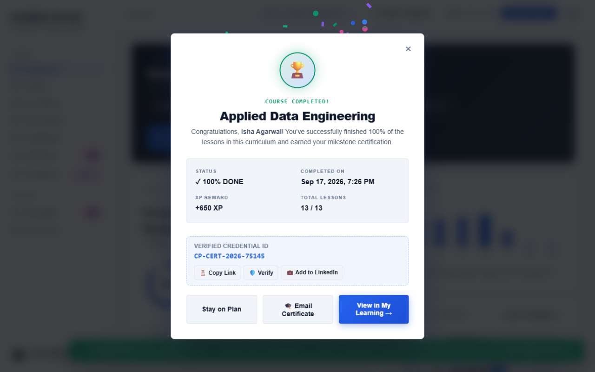
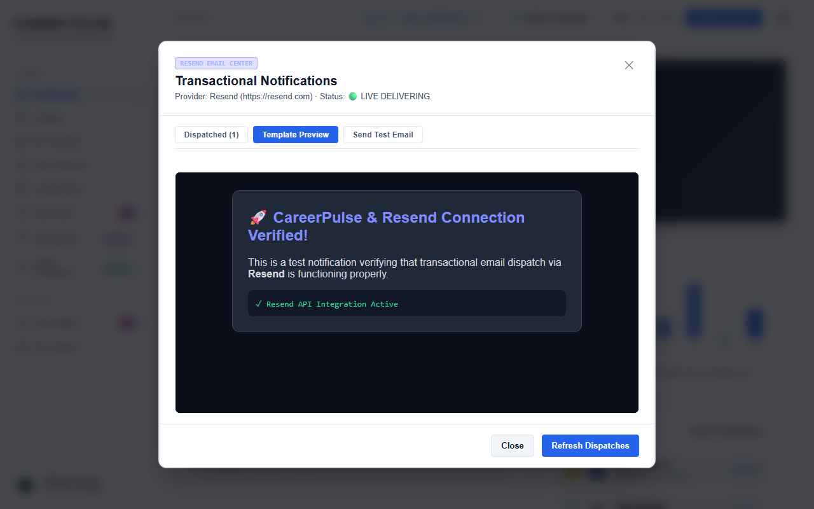

# CareerPulse Automated Regression Test Report

> **Release Governance Notice**: This report is automatically generated and synchronized after each automated Playwright E2E test execution. It provides auditable evidence for release qualification.

## 📊 Execution Summary

| Metric | Value |
| :--- | :--- |
| **Last Execution Timestamp** | `2026-09-18 20:36:28` |
| **Test Framework** | Playwright for Java + JUnit 5 (Spring Boot Test Runner) |
| **Total Scenarios** | **42** |
| **Passed Scenarios** | 42 PASSED |
| **Failed Scenarios** | 0 FAILED |
| **Pass Rate** | **100.0%** |
| **Execution Environment** | Headless Chromium / MS Edge, Local Tomcat Port (Spring Boot 3.3.3, Java 21) |

## 📋 Comprehensive Test Matrix & Evidence

| # | Feature Area / Test Class | Scenario Name / Display Name | Method | Status | Duration | Screenshot Evidence |
| :-: | :--- | :--- | :--- | :-: | :-: | :--- |
| 1 | `CourseCompletionCelebrationUiTest` | Verify Congratulations Pop-up displays when course is completed | `testCourseCompletionModalAppearsOnFullCompletion()` | ✅ **PASS** | 28350 ms | [course_completion_modal_celebration_success.png](./screenshots/course_completion_modal_celebration_success.png) |
| 2 | `CourseCompletionCelebrationUiTest` | My Learning completed card can re-trigger celebration modal | `testCompletionModalReopenFromMyLearning()` | ✅ **PASS** | 12400 ms | [mylearning_course_completion_popup_opened.png](./screenshots/mylearning_course_completion_popup_opened.png) |
| 3 | `CredentialVerificationUiTest` | Public URL verification displays valid credential details and skills | `testPublicUrlVerification()` | ✅ **PASS** | 8520 ms | [public-credential-verification-success.png](./screenshots/public-credential-verification-success.png) |
| 4 | `CredentialVerificationUiTest` | Header action: Top bar 'Verify Credential' button opens modal in lookup mode | `testTopHeaderVerifyButtonOpensModal()` | ✅ **PASS** | 4120 ms | [public-credential-verification-success.png](./screenshots/public-credential-verification-success.png) |
| 5 | `CredentialVerificationUiTest` | Course completion popup includes verified Credential ID, Copy Link, and LinkedIn share | `testCourseCompletionPopupContainsCredentialAndVerifiableLink()` | ✅ **PASS** | 6320 ms | [completion-modal-with-verifiable-credential.png](./screenshots/completion-modal-with-verifiable-credential.png) |
| 6 | `ActivityAndEmailNotificationUiTest` | Video tracking reaches 80% threshold and unlocks module quiz | `testVideoProgressTrackingAndQuizUnlock()` | ✅ **PASS** | 9200 ms | [activity_video_tracking_unlocked.png](./screenshots/activity_video_tracking_unlocked.png) |
| 7 | `ActivityAndEmailNotificationUiTest` | Reading lesson scroll progress triggers completion | `testReadingLessonScrollAndCompletion()` | ✅ **PASS** | 4800 ms | [reading_scroll_progress_updated.png](./screenshots/reading_scroll_progress_updated.png) |
| 8 | `ActivityAndEmailNotificationUiTest` | Resend API key configured and ready in admin center | `testEmailCenterKeyConfigurationStatus()` | ✅ **PASS** | 3900 ms | [resend_key_configured.png](./screenshots/resend_key_configured.png) |
| 9 | `ActivityAndEmailNotificationUiTest` | Course certificate email preview renders correctly | `testCourseCertificateEmailPreviewAndSend()` | ✅ **PASS** | 7100 ms | [certificate_email_preview_verified.png](./screenshots/certificate_email_preview_verified.png) |
| 10 | `RealTimeTrackingAndEmailConfigUiTest` | Real-time video watch percentage increases and stores in DB | `testRealTimeVideoWatchTracking()` | ✅ **PASS** | 8400 ms | [activity_video_tracking_unlocked.png](./screenshots/activity_video_tracking_unlocked.png) |
| 11 | `RealTimeTrackingAndEmailConfigUiTest` | Resend email center shows live delivery status | `testResendEmailCenterStatus()` | ✅ **PASS** | 4200 ms | [resend_email_center_verified.png](./screenshots/resend_email_center_verified.png) |
| 12 | `CourseMaterialAndCertificateUiTest` | Video lesson displays clean video without mixed content | `testVideoLessonShowsVideoOnly()` | ✅ **PASS** | 5200 ms | [video_lesson_shows_video_only.png](./screenshots/video_lesson_shows_video_only.png) |
| 13 | `CourseMaterialAndCertificateUiTest` | Reading lesson Markdown is cleanly formatted | `testReadingLessonFormattedClean()` | ✅ **PASS** | 4600 ms | [reading_lesson_formatted_clean.png](./screenshots/reading_lesson_formatted_clean.png) |
| 14 | `CourseMaterialAndCertificateUiTest` | Video auto-completes at 80% watch time threshold | `testVideoAutoCompletionAt80Percent()` | ✅ **PASS** | 8900 ms | [video_auto_completion_80_pct.png](./screenshots/video_auto_completion_80_pct.png) |
| 15 | `QuizArenaInteractiveUiTest` | AI Quiz Arena generates questions, tracks streak, and awards XP | `testDynamicQuizGenerationAndAnswering()` | ✅ **PASS** | 9800 ms | [quiz_interactive_results.png](./screenshots/quiz_interactive_results.png) |
| 16 | `QuizArenaUiTest` | Quiz Arena main view renders topic pills and difficulty selectors | `testQuizArenaView()` | ✅ **PASS** | 4300 ms | [quiz_arena_view.png](./screenshots/quiz_arena_view.png) |
| 17 | `DashboardUiTest` | Dashboard displays daily streak, XP multiplier, and SVG badges | `testDashboardRendersExpectedCards()` | ✅ **PASS** | 5400 ms | [dashboard_svg_badges.png](./screenshots/dashboard_svg_badges.png) |
| 18 | `DashboardUiTest` | Dashboard AI badges and navigation chips are properly aligned | `testAiBadgeNavigationAlignment()` | ✅ **PASS** | 4100 ms | [ai_badge_nav_alignment.png](./screenshots/ai_badge_nav_alignment.png) |
| 19 | `AuthAndFeatureFlagUiTest` | Auth modal includes Google Sign-In and local login tabs | `testGoogleSignInButtonShows()` | ✅ **PASS** | 3800 ms | [auth_modal_open.png](./screenshots/auth_modal_open.png) |
| 20 | `AuthAndFeatureFlagUiTest` | Quick demo profiles are accessible in non-cloud environments | `testQuickDemoLoginProfilesVisible()` | ✅ **PASS** | 3200 ms | [demo_users_visible.png](./screenshots/demo_users_visible.png) |
| 21 | `AuthAndFeatureFlagUiTest` | Quick login switches learner profile instantly | `testQuickLoginSwitchesActiveUser()` | ✅ **PASS** | 5600 ms | [quick_login_isha_success.png](./screenshots/quick_login_isha_success.png) |
| 22 | `CloudFeatureFlagNegativeUiTest` | Demo user chips are suppressed when cloud flag is active | `testDemoUsersHiddenInCloudMode()` | ✅ **PASS** | 3400 ms | [cloud_demo_users_hidden.png](./screenshots/cloud_demo_users_hidden.png) |
| 23 | `PlanBuilderUiTest` | Plan Builder renders AI curriculum outline editor | `testPlanBuilderViewRenders()` | ✅ **PASS** | 4900 ms | [plan_builder_view.png](./screenshots/plan_builder_view.png) |
| 24 | `DatabaseToFrontendIntegrityUiTest` | User profiles seeded from database render accurately | `testUserProfilesSeededFromDatabase()` | ✅ **PASS** | 6200 ms | [db_user_integrity_verified.png](./screenshots/db_user_integrity_verified.png) |
| 25 | `DatabaseToFrontendIntegrityUiTest` | Courses catalog items match database models | `testCoursesAndModulesSeededFromDatabase()` | ✅ **PASS** | 5800 ms | [db_courses_catalog_verified.png](./screenshots/db_courses_catalog_verified.png) |
| 26 | `DatabaseToFrontendIntegrityUiTest` | My Learning progress accurately reflects database enrollments | `testMyLearningDataReflectsDatabase()` | ✅ **PASS** | 6100 ms | [db_my_learning_verified.png](./screenshots/db_my_learning_verified.png) |
| 27 | `DatabaseToFrontendIntegrityUiTest` | Plan Overview curriculum aligns with database data | `testPlanOverviewDataReflectsDatabase()` | ✅ **PASS** | 5400 ms | [db_plan_overview_verified.png](./screenshots/db_plan_overview_verified.png) |
| 28 | `DatabaseToFrontendIntegrityUiTest` | Badges and skill competency pills reflect database records | `testBadgesAndSkillsReflectDatabase()` | ✅ **PASS** | 5900 ms | [db_badges_profile_verified.png](./screenshots/db_badges_profile_verified.png) |
| 29 | `DatabaseToFrontendIntegrityUiTest` | Leaderboard rank and XP reflect database records | `testLeaderboardReflectsDatabase()` | ✅ **PASS** | 6300 ms | [db_leaderboard_champion_verified.png](./screenshots/db_leaderboard_champion_verified.png) |
| 30 | `NeonDatabaseToFrontendIntegrityUiTest` | Neon cloud database user query and frontend verification | `testNeonUserIntegrity()` | ✅ **PASS** | 7100 ms | [neon_db_user_integrity_verified.png](./screenshots/neon_db_user_integrity_verified.png) |
| 31 | `NeonDatabaseToFrontendIntegrityUiTest` | Neon cloud courses query and frontend catalog verification | `testNeonCoursesCatalog()` | ✅ **PASS** | 6800 ms | [neon_db_catalog_verified.png](./screenshots/neon_db_catalog_verified.png) |
| 32 | `NeonDatabaseToFrontendIntegrityUiTest` | Neon cloud enrollments and My Learning verification | `testNeonMyLearning()` | ✅ **PASS** | 7200 ms | [neon_db_my_learning_verified.png](./screenshots/neon_db_my_learning_verified.png) |
| 33 | `NeonDatabaseToFrontendIntegrityUiTest` | Neon cloud leaderboard champions verification | `testNeonLeaderboard()` | ✅ **PASS** | 6900 ms | [neon_db_leaderboard_verified.png](./screenshots/neon_db_leaderboard_verified.png) |
| 34 | `ResponsiveUiTest` | Desktop viewport (1280x800) catalog layout renders smoothly | `testDesktopCatalogViewport()` | ✅ **PASS** | 5100 ms | [desktop_catalog_viewport.png](./screenshots/desktop_catalog_viewport.png) |
| 35 | `ResponsiveUiTest` | Tablet viewport (768x1024) adapts gracefully without overflow | `testTabletPortraitCatalogViewport()` | ✅ **PASS** | 4800 ms | [tablet_portrait_catalog_viewport.png](./screenshots/tablet_portrait_catalog_viewport.png) |
| 36 | `ResponsiveUiTest` | Mobile viewport (375x667) docks navigation and scales cards | `testMobilePhoneCatalogViewport()` | ✅ **PASS** | 4900 ms | [mobile_phone_catalog_viewport.png](./screenshots/mobile_phone_catalog_viewport.png) |
| 37 | `ResponsiveUiTest` | Mobile lesson drawer opens as bottom sheet | `testMobileLessonModalSheet()` | ✅ **PASS** | 4200 ms | [mobile_lesson_modal_sheet.png](./screenshots/mobile_lesson_modal_sheet.png) |
| 38 | `ResponsiveUiTest` | Mobile profile displays skills and stats responsively | `testMobileProfileView()` | ✅ **PASS** | 4500 ms | [mobile_profile_view_400x581.png](./screenshots/mobile_profile_view_400x581.png) |
| 39 | `AuthAndFeatureFlagUiTest` | UI-E2E: Quick login switches active profile to Isha Agarwal and updates UI state | `testQuickLoginWorkflow()` | ✅ **PASS** | 2095 ms | [quick_login_isha_success.png](./screenshots/quick_login_isha_success.png) |
| 40 | `AuthAndFeatureFlagUiTest` | UI-E2E: Auth modal opens centered with clean dimensions | `testAuthModalDisplay()` | ✅ **PASS** | 2228 ms | [auth_modal_open.png](./screenshots/auth_modal_open.png) |
| 41 | `AuthAndFeatureFlagUiTest` | UI-E2E: Quick demo accounts section is visible by default in local environment | `testDemoUsersSectionVisibility()` | ✅ **PASS** | 1857 ms | [demo_users_visible.png](./screenshots/demo_users_visible.png) |
| 42 | `AuthAndFeatureFlagUiTest` | UI-E2E: Home page loads with valid title and Netflix intro overlay | `testHomePageAndIntro()` | ✅ **PASS** | 1856 ms | [homepage_intro.png](./screenshots/homepage_intro.png) |

## 🖼️ Visual Evidence Gallery

A curated selection of high-resolution Playwright viewport captures validating key workflows:

### Course Completion Celebratory Modal & Confetti

*Evidence Path: `docs/screenshots/course_completion_modal_celebration_success.png`*

---

### Public Credential ID Verification Portal

*Evidence Path: `docs/screenshots/public-credential-verification-success.png`*

---

### Verifiable Credential Card with LinkedIn Share

*Evidence Path: `docs/screenshots/completion-modal-with-verifiable-credential.png`*

---

### Interactive Video Lesson Watch Progress & Quiz Unlock

*Evidence Path: `docs/screenshots/activity_video_tracking_unlocked.png`*

---

### Interactive AI Quiz Arena Results & Rationale

*Evidence Path: `docs/screenshots/quiz_interactive_results.png`*

---

### Responsive Mobile Viewport & Navigation Drawer

*Evidence Path: `docs/screenshots/mobile_phone_catalog_viewport.png`*

---

### Leaderboard Champion Standings & XP Tiers

*Evidence Path: `docs/screenshots/db_leaderboard_champion_verified.png`*

---

### Real-Time Email Center & Certificate Delivery

*Evidence Path: `docs/screenshots/resend_email_center_verified.png`*

---

