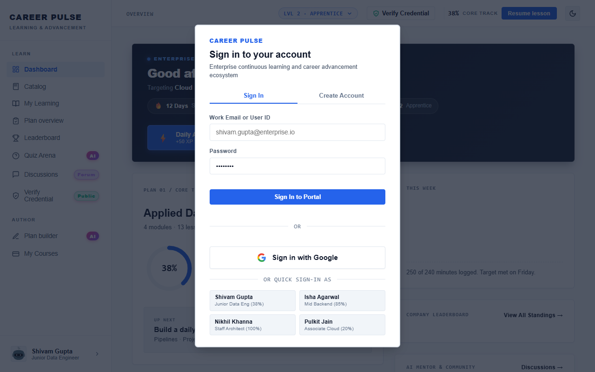
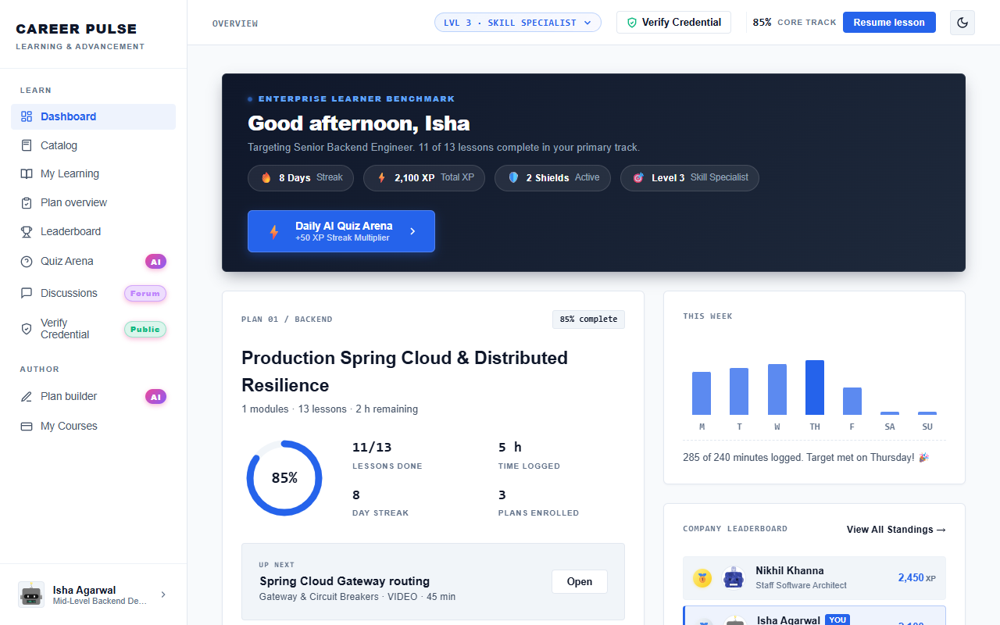
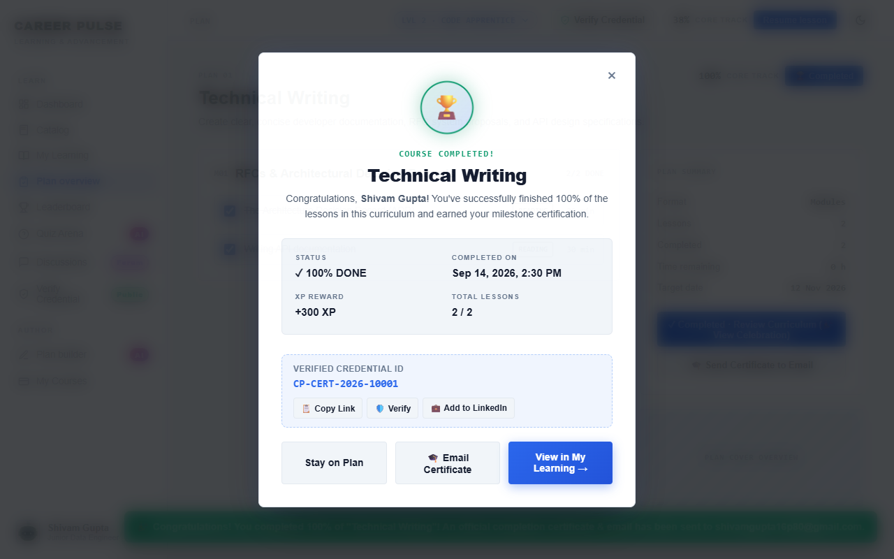
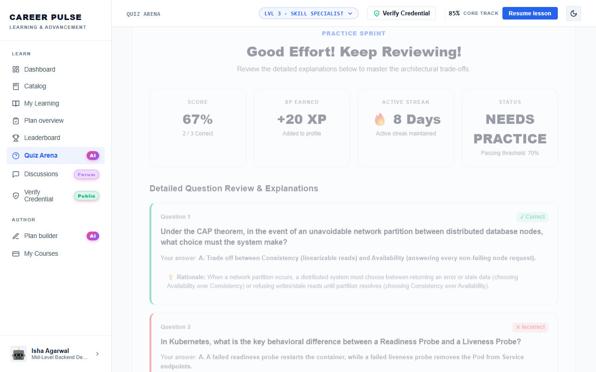
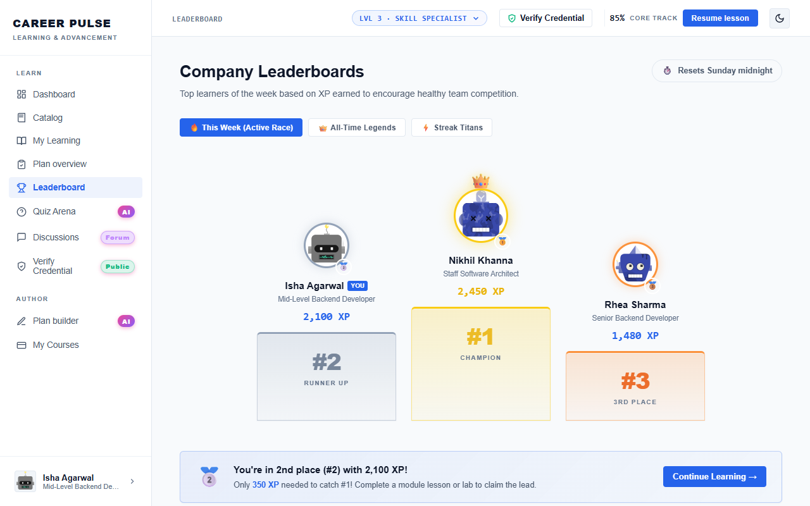
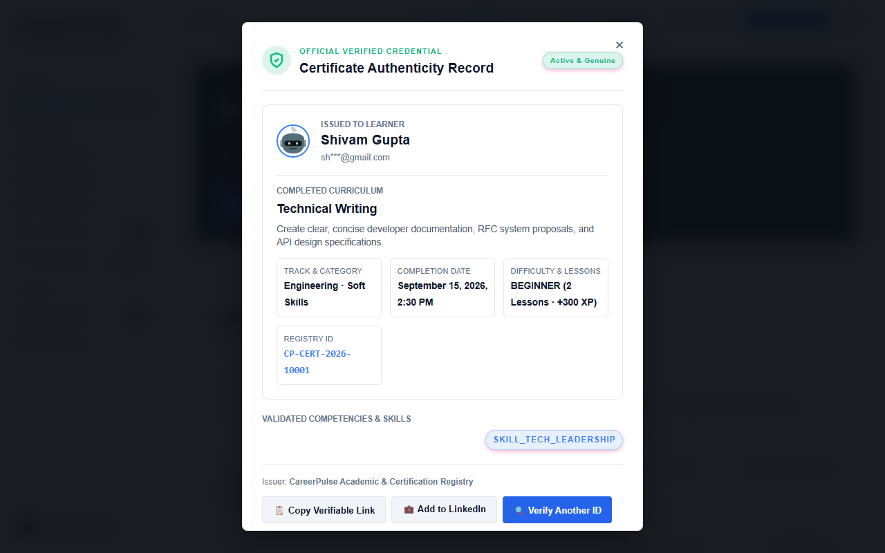
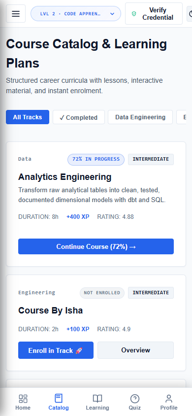

# CareerPulse End-to-End User Guide

Welcome to **CareerPulse**, the enterprise learning, skills benchmarking, and gamification ecosystem. This guide provides comprehensive instructions for learners, curriculum authors, and credential verifiers.

---

## 🎯 Target Audiences & Workflows

1. **[Learners](#1-learner-guide)**: Upskilling, completing courses, tracking video time, taking quizzes, earning badges, and sharing certificates.
2. **[Curriculum Authors](#2-author-guide)**: Building custom curriculums using AI outline generation and publishing modules.
3. **[Credential Verifiers & Employers](#3-public-credential-verification)**: Authenticating learner certificates via unique Credential IDs and public URLs.
4. **[Desktop & Mobile Users](#4-desktop-app--mobile-experience)**: Utilizing the native Electron application and mobile responsive dock.

---

## 1. Learner Guide

### A. Signing In & Profile Switching
1. Navigate to the CareerPulse URL (`https://careerpulse-lms.onrender.com` or local `http://localhost:8080`).
2. If accessing for the first time, click **Sign In** on the top navigation bar.
3. Select your work account credentials, use **Sign In with Google**, or click any of the **Quick Demo Profiles** (e.g., *Shivam Gupta*, *Isha Agarwal*, *Nikhil Khanna*).

---

### B. Navigating the Dashboard
The **Dashboard** serves as your personal mission control:
* **Study Streak**: Displays your consecutive daily learning streak and active streak freeze shields.
* **XP Multiplier**: Shows your active score bonus tier based on weekly study consistency.
* **Weekly Study Log**: Interactive Monday–Sunday chart tracking your daily focus minutes against your 240-minute enterprise benchmark.
* **Next Up Recommendation**: Instantly jump back into your highest priority in-progress lesson with one click on **"Resume Lesson"**.

---

### C. Exploring the Catalog & Enrolling in Courses
1. Click **Catalog** in the left navigation sidebar.
2. Filter courses by category (Backend, Cloud, DevOps, Data) or search by keyword.
3. Review prerequisites, lesson counts, estimated duration, and XP reward values.
4. Click **Enroll** to add any course to your active learning pathway immediately.

---

### D. Completing Lessons & Tracking Video Progress
1. Open **My Learning** and select an enrolled course.
2. **Reading Lessons**: Scroll through the formatted technical lesson content. Reaching the bottom automatically updates your lesson progress.
3. **Video Lessons**: Play the embedded video. CareerPulse monitors real-time watch progression:
   * Reaching **80% watch time** automatically marks the video lesson complete.
   * Module quizzes remain locked until all preceding video lessons meet the 80% threshold.

---

### E. Course Completion & Milestones
When all modules and lessons in a course reach 100%:
1. A **Celebration Pop-up** automatically triggers with full-screen celebratory confetti and audio fanfares.
2. You receive your milestone XP reward and a unique **Verified Credential ID** (e.g., `CP-CERT-2026-73235`).
3. An official branded completion certificate is automatically dispatched to your work email via **Resend**.
4. Click **💼 Add to LinkedIn** to pre-fill and publish your verifiable certificate directly onto your LinkedIn profile.
5. Click **📋 Copy Link** to copy your public verification link to your clipboard.

---

### F. Taking AI Quizzes in the Quiz Arena
1. Click **Quiz Arena** in the sidebar.
2. Select your topic or let the **Google Gemini AI** generate a dynamic assessment tailored to your enrolled track.
3. Answer the multiple-choice questions within the allotted timer.
4. Upon submitting, review your score breakdown, XP earned, and instant architectural rationales explaining the correct answer for every question.

---

### G. Discussions & AI Mentor
1. Click **Discussions** in the left sidebar to open course topic forums.
2. Post technical questions or participate in architectural discussions.
3. The **CareerPulse AI Mentor** automatically analyzes technical inquiries and posts comprehensive, structured solutions within seconds.

---

### H. Leaderboard & Learner Passport
1. Click **Leaderboard** to view real-time department and global rankings based on earned XP and streak shields.
2. Click your profile avatar in the bottom-left to open your **Learner Passport**:
   * View verified competencies.
   * Click **+ Add Skill** to register custom competencies with proficiency levels (Beginner, Intermediate, Advanced, Expert).

---

## 2. Author Guide

### Using Plan Builder
1. Click **Plan Builder** under the `AUTHOR` section in the sidebar.
2. Enter your course title, target role, and key topics.
3. Click **Generate AI Curriculum**: The AI assistant structures recommended modules, learning objectives, and quiz checkpoints.
4. Customize lesson text, embed video URLs, and configure passing score thresholds.
5. Click **Publish Course** to make the course available in the enterprise catalog.

---

## 3. Public Credential Verification

Anyone (including recruiters, hiring managers, and enterprise auditors) can verify certificates without logging in:
1. **Via Direct Public URL**: Navigate to `https://careerpulse-lms.onrender.com/?verify=CP-CERT-2026-XXXXX`.
2. **Via Top Navigation Header**: Click **🛡️ Verify Credential** in the top navigation bar, enter the Credential ID, and click **Verify**.
3. The verified card displays:
   * Learner Full Name
   * Course Title and Curriculum Track
   * Completion Date and Verification Hash
   * Verified Skill Competencies
   * Authenticity badge confirmed by the enterprise registry.

---

## 4. Desktop App & Mobile Experience

### Desktop App (Electron)
* **Launch**: Run `npm run start` inside the `desktop/` directory or launch the packaged installer.
* **Menus**: Full keyboard shortcuts (`Ctrl+1` through `Ctrl+7`) for instant view navigation.
* **System Tray**: Minimizes to system notification tray on close.
* **Offline Protection**: If internet connection drops, an offline recovery screen appears with auto-reconnect polling.
* **Safe Link Delegation**: Clicking "Add to LinkedIn" or external documentation safely launches your default Windows web browser (Chrome/Edge) to protect your authenticated credentials.

### Mobile & Tablet Experience
* Open CareerPulse on any phone or tablet browser.
* Navigation transforms into an ergonomic bottom dock and side drawer.
* Lesson drawers open as responsive bottom sheets for one-thumb mobile learning.

