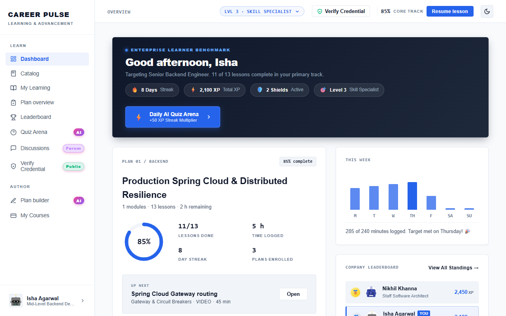

# Feature Guide 01: Dashboard & Gamification Engine

The **Dashboard** is the learner's central command center in CareerPulse, synthesizing real-time progress, daily habit tracking, gamified rewards, and role benchmark analytics.

---

## 🌟 Capabilities & User Value

* **Daily Study Streak**: Tracks consecutive active learning days with visual flame icons and streak milestone callouts.
* **Streak Freeze Shields**: Protects your streak from resetting if you miss a single day of learning.
* **Dynamic XP Multiplier**: Grants bonus XP multipliers (up to 1.5x) for consistent daily practice.
* **Weekly Focus Log**: Interactive Monday–Sunday chart tracking daily study minutes against a 240-minute enterprise learning benchmark.
* **Instant Resume Call-to-Action**: Always displays your next pending lesson with one-click navigation to pick up where you left off.

---

## 🖼️ Visual Evidence


*Figure 1: Main Dashboard showing streak stats, weekly study tracking, and next lesson prompt.*


*Figure 2: Precision alignment of SVG gamification chips and AI indicator badges.*

---

## 🛠️ How It Works (Step-by-Step Instructions)

1. **Sign in** to CareerPulse. The dashboard automatically computes your latest streak and loads your weekly progress logs.
2. Review the **Enterprise Learner Benchmark card** at the top:
   * Displays target role title (e.g., *Senior Backend Engineer*).
   * Displays primary track progress percentage (e.g., *11 of 13 lessons complete · 85%*).
3. Inspect your **Weekly Study Logs**:
   * Each bar represents actual time spent in reading lessons and watching video modules for that day.
   * Days meeting the daily target highlight in vibrant enterprise emerald.
4. Click **"Resume lesson"** in the top header or on the dashboard hero card to jump straight into your current course.

---

## 🔌 Technical Architecture & APIs

* **Backend Endpoint**: `GET /api/gamification/summary`
* **Response Payload**:
  ```json
  {
    "userId": "user_1",
    "streakDays": 8,
    "streakShields": 2,
    "xpMultiplier": 1.25,
    "totalXp": 1950,
    "level": "LVL 3 · SKILL SPECIALIST",
    "weeklyMinutes": [45, 60, 30, 90, 60, 0, 0],
    "targetMinutes": 240
  }
  ```
* **Frontend View Controller**: `App.renderDashboard()` in `src/main/resources/static/js/app.js`.
* **Playwright Verification**: Tested by [`DashboardUiTest.java`](../../src/test/java/com/learning/platform/ui/DashboardUiTest.java).
