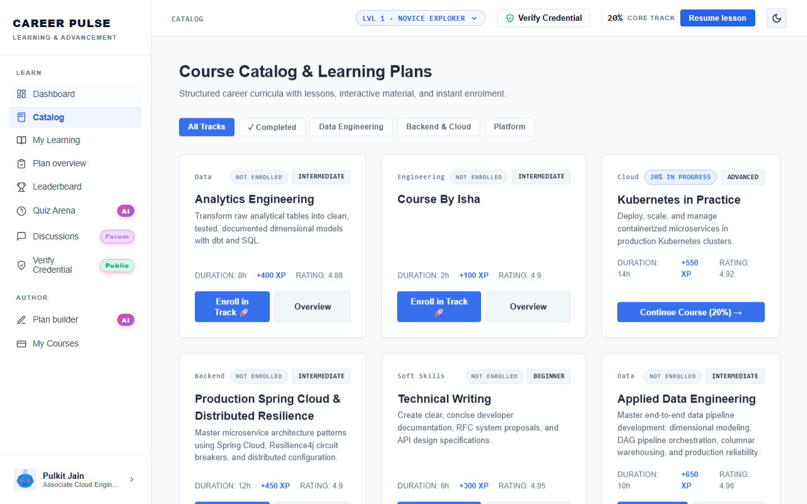
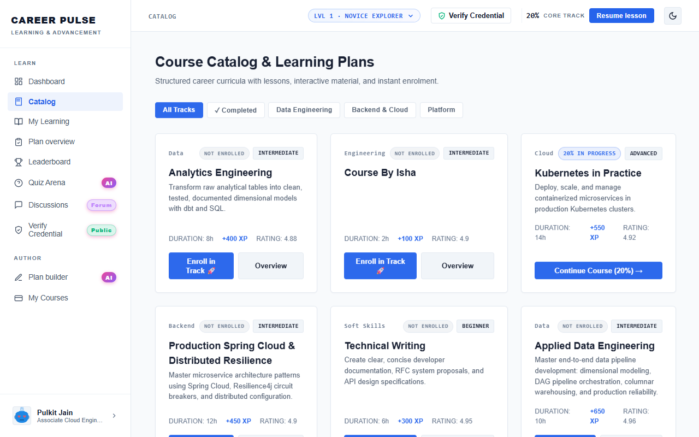

# Feature Guide 02: Course Catalog & Instant Enrollment

The **Course Catalog** enables learners to explore, filter, and enroll in curated enterprise technical tracks and specialization curriculums.

---

## 🌟 Capabilities & User Value

* **Multi-Domain Taxonomy**: Browse curriculums categorized across Backend, Cloud Architecture, DevOps & SRE, and Data Engineering.
* **Prerequisites & Effort Estimation**: Each course card transparently details estimated hours, lesson counts, module breakdown, and skill level.
* **Instant One-Click Enrollment**: Immediate enrollment state transition without page reloads.
* **Enrolled vs. Available Visual Cues**: Cards dynamically render "Enrolled · Continue" or "Enroll Now" buttons depending on active user state.

---

## 🖼️ Visual Evidence


*Figure 1: Enterprise Course Catalog with category filters and active enrollment states.*


*Figure 2: Responsive card grid layout with uniform button positioning.*

---

## 🛠️ How It Works (Step-by-Step Instructions)

1. Click **Catalog** in the left sidebar navigation.
2. Filter the catalog by category chips (e.g., *All*, *Backend*, *Cloud*, *Data*) or type a keyword in the search bar.
3. On an unenrolled course, click **"Enroll"**:
   * The system immediately creates an active enrollment record.
   * Button transitions to **"✓ Enrolled · Start Course"**.
   * Course is simultaneously added to your **My Learning** workspace.
4. Click **"Start Course"** or **"Continue"** to open the curriculum roadmap in the Plan Overview.

---

## 🔌 Technical Architecture & APIs

* **List Catalog Courses**: `GET /api/courses`
* **Enroll in Course**: `POST /api/enrollments/enroll?courseId={courseId}`
* **Response Payload**:
  ```json
  {
    "id": "enr_tw_01_user_1",
    "userId": "user_1",
    "courseId": "PLAN_TW_01",
    "status": "IN_PROGRESS",
    "progressPct": 0,
    "enrolledAt": "2026-09-17T10:00:00Z"
  }
  ```
* **In-Memory High-Speed Cache**: Backed by `CourseService.java` pre-warmed on Spring Boot initialization.
* **Playwright Verification**: Tested by [`DatabaseToFrontendIntegrityUiTest.java`](../../src/test/java/com/learning/platform/ui/DatabaseToFrontendIntegrityUiTest.java).
