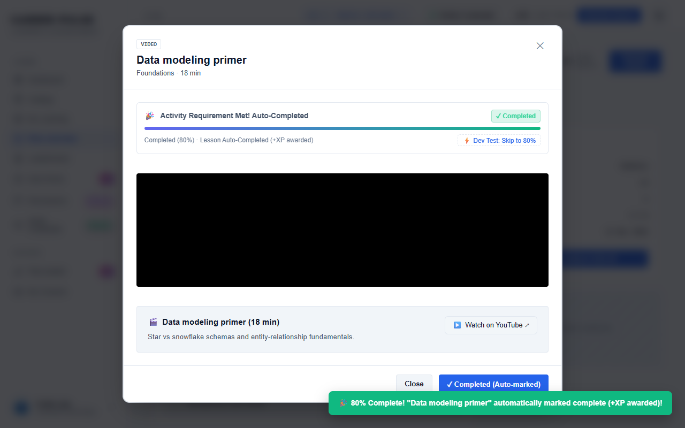
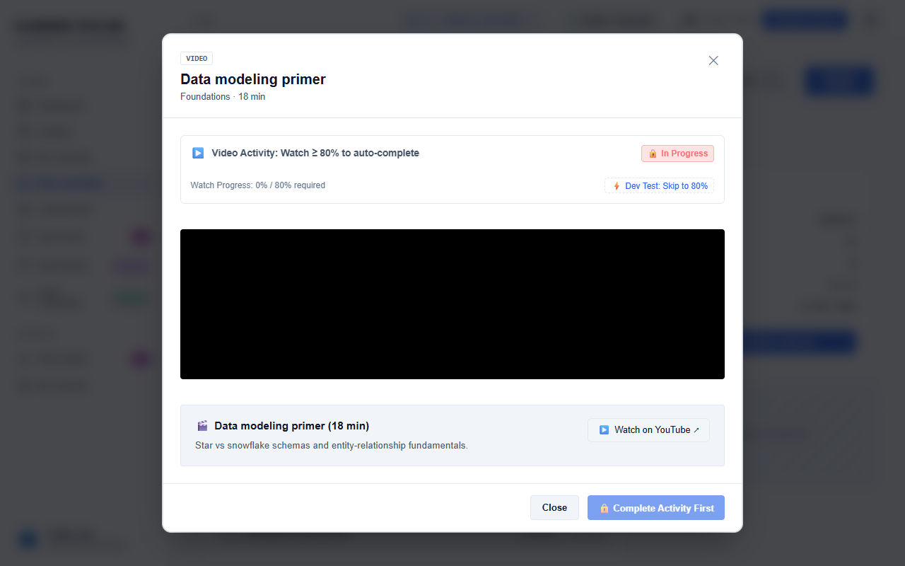
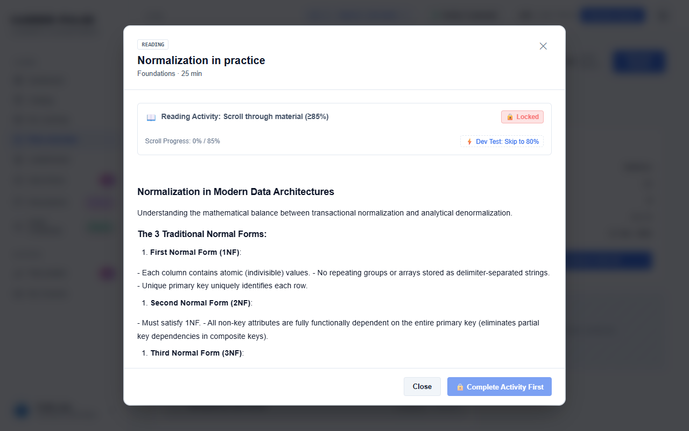

# Feature Guide 03: My Learning & Real-Time Video Watch Tracking

The **My Learning** workspace hosts active coursework and enforces strict educational integrity via real-time video progress tracking.

---

## 🌟 Capabilities & User Value

* **Active & Completed Course Hub**: Separates in-progress tracks from archived/completed milestones.
* **Dual-Format Learning**: Seamlessly renders formatted Markdown reading lessons and HTML5/YouTube video lessons.
* **80% Watch-Time Completion Guard**: Video lessons require at least 80% genuine watch progress before marking complete.
* **Quiz Prerequisite Gating**: Module quizzes remain locked until all preceding video and reading lessons meet completion requirements.
* **Scroll-to-Complete Reading**: Reading lessons track viewport scroll progress, marking complete when the learner reaches the conclusion.

---

## 🖼️ Visual Evidence


*Figure 1: Video lesson player showing live watch progress reaching the 80% threshold and unlocking the module quiz.*


*Figure 2: Distraction-free video player interface.*


*Figure 3: Clean Markdown rendering for technical reading modules.*

---

## 🛠️ How It Works (Step-by-Step Instructions)

1. Navigate to **My Learning** and select any active course.
2. Select a lesson from the module curriculum list:
   * **For Video Lessons**: Press Play. CareerPulse samples elapsed playback every 1,000ms.
   * As playback passes **80%**, the badge updates to **"✓ Completed"** and saves progress to the database.
   * If a module quiz follows, its lock icon transitions to **"Start Quiz"**.
3. **For Reading Lessons**: Read through the materials. Once scrolled to the bottom, the lesson marks complete.

---

## 🔌 Technical Architecture & APIs

* **Update Progress API**: `POST /api/enrollments/progress`
* **Request Payload**:
  ```json
  {
    "courseId": "PLAN_ADE_01",
    "lessonId": "LES_ADE_01_VID",
    "watchTimeSeconds": 240,
    "totalDurationSeconds": 300,
    "progressPct": 80.0
  }
  ```
* **Client Video Engine**: Embedded video event listeners in `src/main/resources/static/js/app.js` (`onTimeUpdate`).
* **Playwright Verification**: Tested by [`ActivityAndEmailNotificationUiTest.java`](../../src/test/java/com/learning/platform/ui/ActivityAndEmailNotificationUiTest.java) and [`RealTimeTrackingAndEmailConfigUiTest.java`](../../src/test/java/com/learning/platform/ui/RealTimeTrackingAndEmailConfigUiTest.java).
