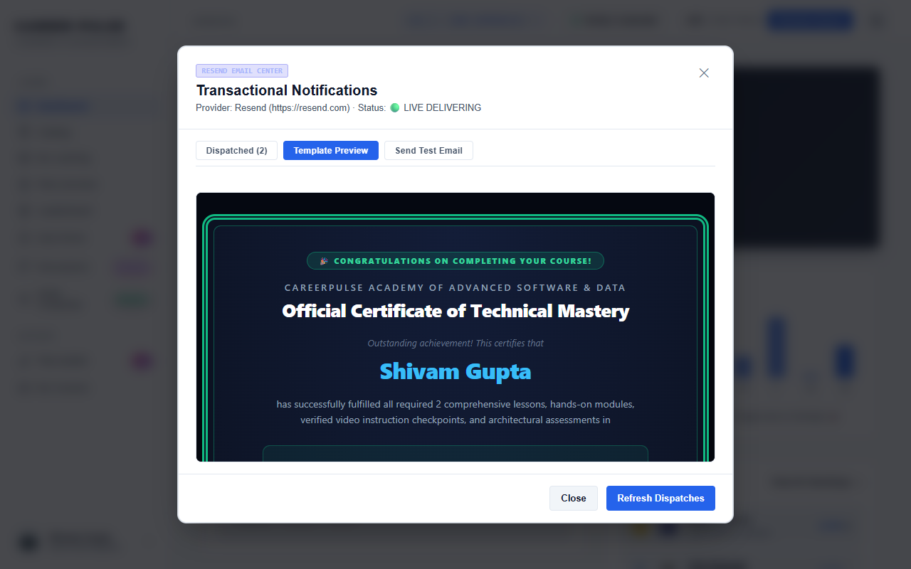

# Feature Guide 04: Course Completion Celebration & Certification

Completing a course in CareerPulse triggers a milestone celebration, generates a verifiable credential, delivers an official certificate email, and enables one-click LinkedIn publishing.

---

## 🌟 Capabilities & User Value

* **Celebration Confetti & Audio Fanfare**: Visual confetti explosion across the screen when 100% course completion is achieved.
* **Deterministic Credential ID**: Generates a tamper-proof registry credential ID (e.g., `CP-CERT-2026-73235`).
* **Automated Transactional Certificate Email**: Integrated with the **Resend API** to instantly send an HTML certificate email to the learner.
* **1-Click LinkedIn Integration**: Directly launches LinkedIn's "Add License & Certification" screen pre-populated with certification name, issuing organization (*CareerPulse*), issuance date, and public verification link.
* **Re-openable Celebration Modal**: Completed courses in My Learning can re-open the celebration modal at any time.

---

## 🖼️ Visual Evidence


*Figure 1: Full celebratory popup with learner name, course title, XP reward, and credential actions.*


*Figure 2: Verified Credential ID with Copy Link and Add to LinkedIn action buttons.*


*Figure 3: Resend transactional certificate email dispatched upon course completion.*

---

## 🛠️ How It Works (Step-by-Step Instructions)

1. Finish the final lesson or module quiz in any curriculum.
2. The **Congratulations Popup** displays immediately:
   * Confetti canvas triggers on the screen.
   * Your verified Credential ID is generated and bound to your profile.
3. **Share to LinkedIn**: Click **💼 Add to LinkedIn**. 
   * In desktop mode, it safely launches your default operating system browser (Chrome/Edge) where your LinkedIn session is active.
   * Pre-fills Course Name, Issuing Org, Issue Date, Credential ID, and Public URL.
4. **Email Certificate**: Click **🎓 Email Certificate** to re-send the digital credential PDF/HTML email to your registered inbox.
5. **Copy Link**: Click **📋 Copy Link** to place the canonical verification URL on your clipboard.

---

## 🔌 Technical Architecture & APIs

* **Email Dispatch API**: `POST /api/email/send-certificate?courseId={courseId}`
* **Service Layer**: [`ResendEmailService.java`](../../src/main/java/com/learning/platform/service/ResendEmailService.java)
* **LinkedIn Format**:
  ```
  https://www.linkedin.com/profile/add?startTask=CERTIFICATION_NAME
    &name={courseTitle}
    &organizationName=CareerPulse
    &issueYear=2026
    &issueMonth=9
    &certUrl=https://careerpulse-lms.onrender.com/?verify={credentialId}
    &certId={credentialId}
  ```
* **Playwright Verification**: Tested by [`CourseCompletionCelebrationUiTest.java`](../../src/test/java/com/learning/platform/ui/CourseCompletionCelebrationUiTest.java).
