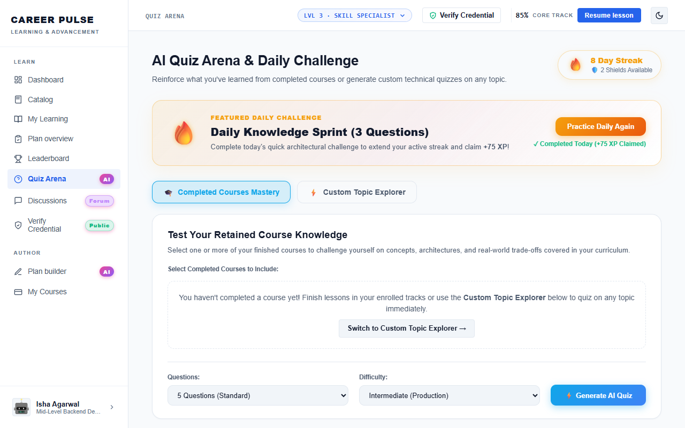

# Feature Guide 06: AI Quiz Arena (Google Gemini)

The **AI Quiz Arena** tests learner retention using real-time generative AI assessments powered by Google Gemini, paired with competitive timer scoring and streak multipliers.

---

## 🌟 Capabilities & User Value

* **On-Demand Dynamic Generation**: Quizzes are synthesized dynamically on any technical topic or completed course.
* **Instant Architectural Rationales**: Every question provides detailed explanations for why the correct option was right and why distractors were suboptimal.
* **Daily Multiplier Mechanics**: Taking the daily quiz increases your active XP streak multiplier.
* **Topic Pill Selection**: Quickly trigger quizzes across Spring Boot, Cloud Solutions, Kafka, Kubernetes, or SQL.

---

## 🖼️ Visual Evidence


*Figure 1: Interactive quiz scoring screen showing XP awarded, accuracy score, and rationale explanations.*


*Figure 2: AI Quiz Arena launchpad with topic selection and difficulty tiers.*

---

## 🛠️ How It Works (Step-by-Step Instructions)

1. Click **Quiz Arena** in the sidebar navigation.
2. Choose a topic pill (e.g., *Spring Boot Architecture*, *Kafka Streams*, *AWS Solutions*) or enter a custom technical query.
3. Select difficulty (*Beginner*, *Intermediate*, *Advanced*).
4. Click **"Generate AI Quiz"**: Google Gemini synthesizes 3–5 multi-choice questions.
5. Answer questions before the timer expires.
6. Click **Submit Quiz**:
   * Receive your total score and XP bonus.
   * Review question-by-question technical explanations.

---

## 🔌 Technical Architecture & APIs

* **Generate Quiz API**: `POST /api/ai/generate-quiz`
  ```json
  {
    "topic": "Microservices Resiliency",
    "difficulty": "ADVANCED",
    "questionCount": 3
  }
  ```
* **Controller**: [`AiController.java`](../../src/main/java/com/learning/platform/controller/AiController.java)
* **LLM Model**: Google Gemini Flash API via structured REST prompt engineering.
* **Playwright Verification**: Tested by [`QuizArenaInteractiveUiTest.java`](../../src/test/java/com/learning/platform/ui/QuizArenaInteractiveUiTest.java) and [`QuizArenaUiTest.java`](../../src/test/java/com/learning/platform/ui/QuizArenaUiTest.java).
