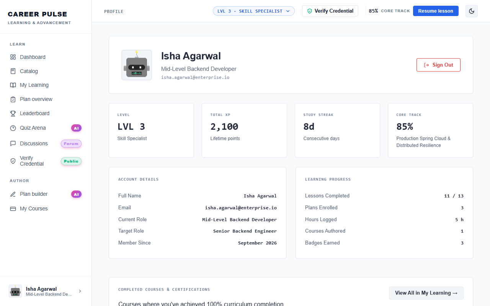

# Feature Guide 08: Leaderboard & Learner Skills Passport

The **Leaderboard** and **Learner Passport** power CareerPulse's social recognition and verifiable skill competency tracking.

---

## 🌟 Capabilities & User Value

* **Global & Department Leaderboards**: Ranked view of peer engineers sorted by total XP, streak counts, and milestone honor badges.
* **Champion Honors**: Top 3 engineers receive Gold, Silver, and Bronze crown indicators.
* **Verified Skills Passport**: Displays all skills certified by completed coursework.
* **Custom Competency Registration**: Learners can register and self-declare emerging skills with proficiency tiers (*Beginner*, *Intermediate*, *Advanced*, *Expert*).

---

## 🖼️ Visual Evidence

*Figure 1: Leaderboard displaying ranked engineers, XP totals, and champion status.*

*Figure 2: Learner Passport displaying verified competencies, role title, and earned badges.*

---

## 🛠️ How It Works (Step-by-Step Instructions)

### Viewing the Leaderboard
1. Click **Leaderboard** in the sidebar navigation.
2. Toggle between **All Enterprise** and **My Department**.
3. View your relative rank, total XP, current streak, and badges earned.

### Managing the Skills Passport
1. Click your profile avatar at the bottom of the sidebar to open the **Learner Profile**.
2. Review your verified skill chips (e.g., *Java 21*, *Docker*, *Spring Cloud*).
3. Click **+ Add Skill**:
   * Type the competency name (e.g., *GraphQL*, *Terraform*).
   * Choose proficiency level (*Intermediate*).
   * Click **Save Skill**: The competency immediately adds to your passport.

---

## 🔌 Technical Architecture & APIs

* **Leaderboard API**: `GET /api/leaderboard`
* **Learner Profile API**: `GET /api/users/{userId}`
* **Add Skill API**: `POST /api/users/{userId}/skills`
* **Playwright Verification**: Tested by [`DatabaseToFrontendIntegrityUiTest.java`](../../src/test/java/com/learning/platform/ui/DatabaseToFrontendIntegrityUiTest.java) and [`NeonDatabaseToFrontendIntegrityUiTest.java`](../../src/test/java/com/learning/platform/ui/NeonDatabaseToFrontendIntegrityUiTest.java).
