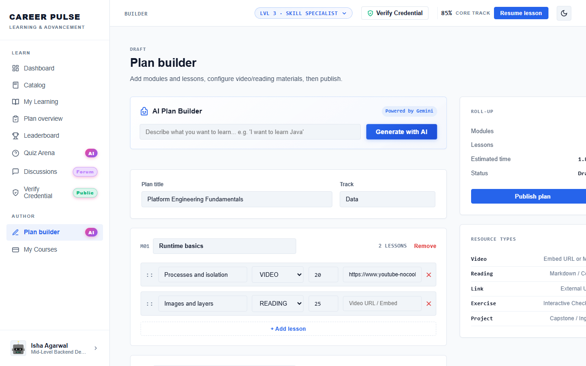

# Feature Guide 09: Author Mode & AI Plan Builder

**Plan Builder** gives curriculum authors, tech leads, and mentors the tools to architect structured courses with automated AI syllabus synthesis.

---

## 🌟 Capabilities & User Value

* **AI-Assisted Curriculum Design**: Enter high-level learning goals and let Gemini AI generate modules, lessons, and learning outcomes.
* **Granular Lesson Authoring**: Add video URLs, formatted Markdown reading lessons, and quiz questions.
* **Prerequisite Mapping**: Link prerequisite courses to structure foundational tracks.
* **XP & Duration Estimation**: Automatically calculate XP rewards and completion hours based on content depth.

---

## 🖼️ Visual Evidence

*Figure 1: AI Plan Builder curriculum designer and module editor.*

---

## 🛠️ How It Works (Step-by-Step Instructions)

1. Navigate to **Plan Builder** under the `AUTHOR` section in the sidebar.
2. Enter the **Curriculum Title** (e.g., *Advanced Distributed Systems*), **Target Role**, and **Summary**.
3. Click **"Generate AI Outline"**:
   * AI proposes 3–4 modules with structured lesson objectives.
4. Customize lesson contents:
   * Select lesson type: **Video Lesson** or **Reading Lesson**.
   * Add text, code examples, or YouTube/MP4 embeds.
5. Set module quiz questions and passing score requirements.
6. Click **"Save Course Plan"** to publish the course to the platform catalog.

---

## 🔌 Technical Architecture & APIs

* **Create Course Plan**: `POST /api/courses`
* **AI Outline Generator**: `POST /api/ai/generate-curriculum`
* **Playwright Verification**: Tested by [`PlanBuilderUiTest.java`](../../src/test/java/com/learning/platform/ui/PlanBuilderUiTest.java).
