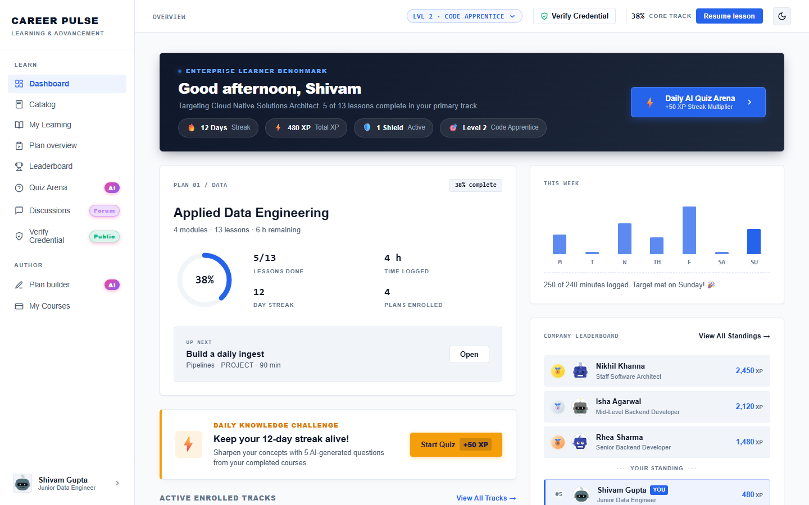
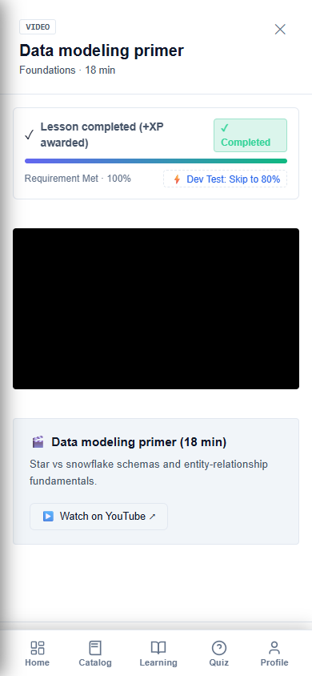
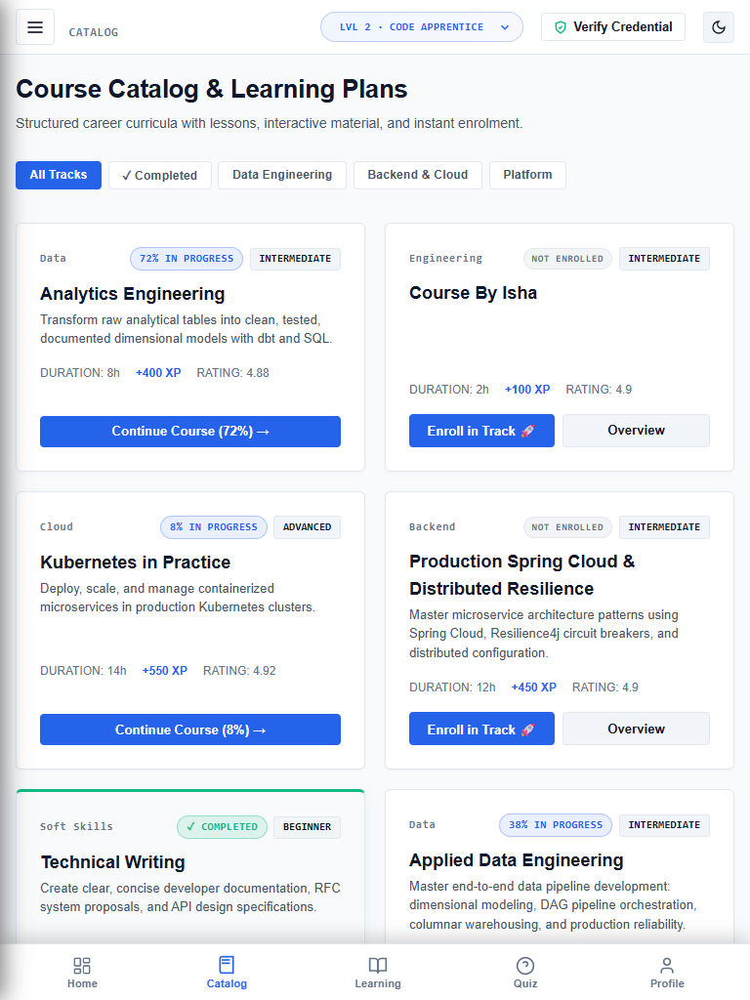

# Feature Guide 10: Cross-Platform Desktop (Electron) & Mobile Responsive PWA

CareerPulse delivers an enterprise-grade experience across all devices, featuring a native **Electron Desktop Application** and a responsive **Mobile Web App**.

---

## 🌟 Capabilities & User Value

### Desktop Application (Electron)
* **Native Menus & Shortcuts**: Keyboard accelerators (`Ctrl+1` through `Ctrl+7`) for quick-switching between views.
* **System Tray Minimization**: Keeps the application running in the background for quick access.
* **Offline Protection**: Automatically renders a branded offline recovery screen if network connection drops.
* **Safe External URL Routing**: Intercepts external links (LinkedIn, GitHub, documentation) and safely launches your default Windows browser (Chrome/Edge), protecting your account credentials and bypassing bot blocks.

### Mobile & Tablet PWA
* **Ergonomic Bottom Navigation Dock**: Puts primary views within thumb's reach on smartphones.
* **Mobile Drawer Navigation**: Slide-out menu for secondary administrative and account actions.
* **Bottom Sheet Lesson Drawers**: Lesson curricula open as responsive bottom sheets on mobile viewports.

---

## 🖼️ Visual Evidence


*Figure 1: Full desktop 1280x800 viewport with comprehensive sidebar and content grid.*


*Figure 2: Mobile 375x667 viewport with bottom navigation dock and scaled cards.*


*Figure 3: Mobile lesson drawer opening as a responsive bottom sheet.*


*Figure 4: Tablet portrait 768x1024 viewport adapting without horizontal scroll.*

---

## 🛠️ How It Works (Step-by-Step Instructions)

### Running the Desktop App
1. From the repository root, enter the desktop folder:
   ```bash
   cd desktop
   npm install
   npm run start
   ```
2. Use `Ctrl+1` for Dashboard, `Ctrl+2` for Catalog, `Ctrl+3` for My Learning, `Ctrl+4` for Quiz Arena, and `Ctrl+6` for Leaderboard.
3. Close the window to minimize to the Windows system tray.

### Accessing on Mobile
1. Open CareerPulse on any smartphone or tablet browser.
2. Notice the desktop sidebar collapses and the **Bottom Navigation Dock** activates.
3. Tap **Catalog**, **Quiz**, or **Profile** from the bottom bar.
4. On iOS/Android, select **"Add to Home Screen"** to install as a PWA.

---

## 🔌 Technical Architecture

* **Electron Entry Point**: [`desktop/src/main.js`](../../desktop/src/main.js)
* **Preload Bridge**: [`desktop/src/preload.js`](../../desktop/src/preload.js)
* **Responsive CSS**: Custom media query breakpoints in [`src/main/resources/static/css/app.css`](../../src/main/resources/static/css/app.css) (`@media (max-width: 768px)` and `@media (max-width: 480px)`).
* **Playwright Verification**: Tested by [`ResponsiveUiTest.java`](../../src/test/java/com/learning/platform/ui/ResponsiveUiTest.java).
